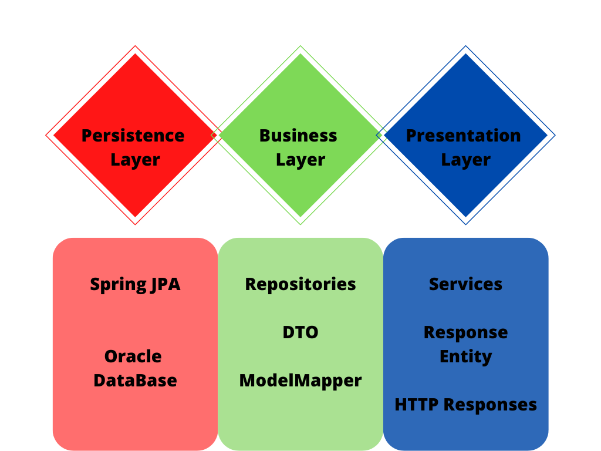
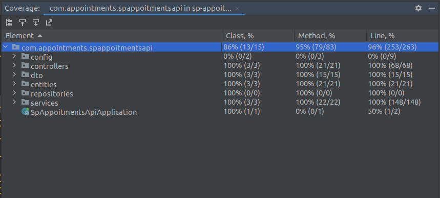

# Medical Appointments API

## Structural definition

| Table         | Field                                             |
|---------------|---------------------------------------------------|
| Tests:        | {“id”, “name”, “description”}                     |
| affiliates:   | {“id”, “name”, “age”, “mail”}                     |
| appointments: | {“id”, “date”, “hour”, “id_test”, “id_affiliate”} |

## Data constraints

| Field        | Type                |
|--------------|---------------------|
| id:          | number              |
| name:        | string              |
| description: | string              |
| mail:        | string              |
| date:        | Date (‘dd/MM/yyyy’) |
| hour:        | Date (‘hh:mm’)      |

## Controllers

| Controller    | Methods                                                                                                                        |
|---------------|--------------------------------------------------------------------------------------------------------------------------------|
| tests:        | getlist  getbyid {id}  post   put   delete {id}                                                                |
| affiliates:   | getlist    getbyid {id}   post   put   delete {id}                                                             |
| appointments: | getlist    getbyid {id}   post   put   delete {id}   getbydate {date}   getbyaffiliates {id_affiliate} |

## Solution

For the solution of this project the following was implemented:

# Test Coverage:

